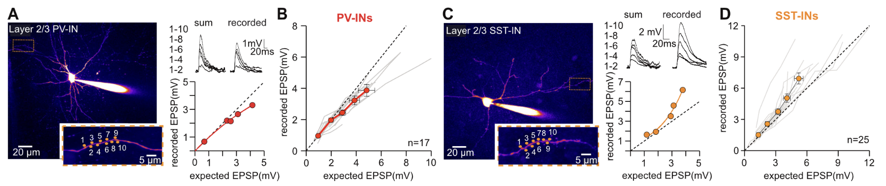
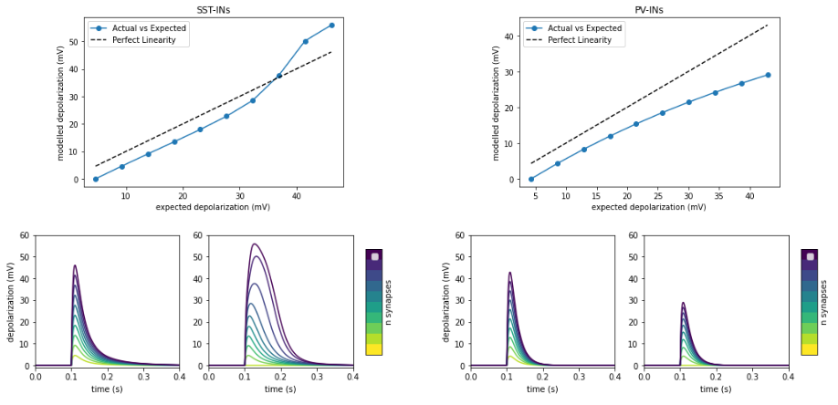

# Report

## Task 1 : Find a reduced cellular model displaying sub-linear responses and supra-linear responses (by varying NMDA-to-AMPA ratio)

## Setting qNMDA to 0 simulates sublinear integration (PV), while integration of NMDA leads to supralinear integration

